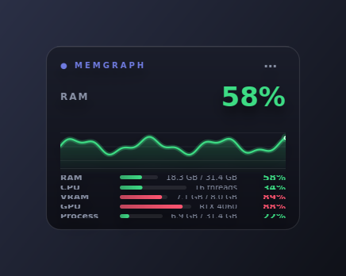
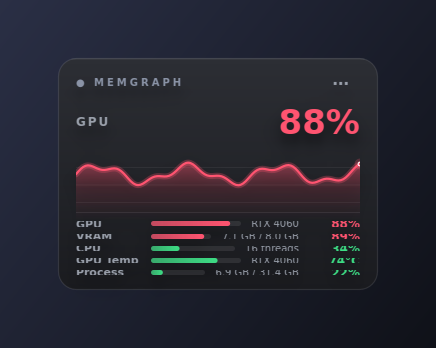
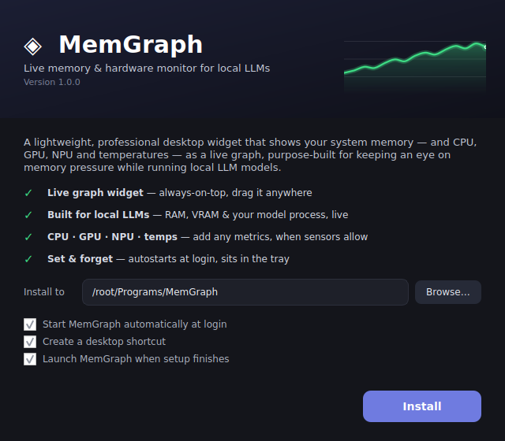

# MemGraph — Windows Memory & Hardware Widget for Local LLMs

A lightweight, professional desktop widget that shows your system memory — and
CPU, GPU, NPU and temperatures — as a **live, hand-painted graph**, purpose-built
for keeping an eye on memory pressure while running local LLMs (Ollama,
llama.cpp, LM Studio, …).



- 📈 **Custom-painted live graph** — smooth curve, gradient glow, no clutter
  (no chart library; drawn with QPainter)
- 🧠 **Built for local LLMs** — watch **RAM**, **GPU VRAM** and your **model
  process** (e.g. `ollama.exe`) in real time
- 🧩 **Fully customisable metrics** — mix and match **RAM, CPU, GPU, NPU,
  process memory** and **CPU / GPU / memory temperatures** (shown when sensors
  expose them)
- 🎨 Frameless, glassy, drop-shadowed panel with **3 themes** — drag it
  anywhere, snaps to edges, remembers its position
- 🟢🟡🔴 Colour thresholds (green → amber → red) for both usage and temperature
- 🔒 **Single instance** — launching again just surfaces the running widget
- 🚀 **Modern setup wizard**, **autostart at login**, and a **system-tray** icon
- 🪶 Tiny footprint — a memory monitor that doesn't hog memory

| Widget themes | Setup wizard |
|---|---|
|  |  |

---

## Install (recommended)

1. Download **`MemGraph-Setup.exe`** — the login-free direct link:
   **https://github.com/priyansh19/HelloWorld/releases/download/memgraph-latest/MemGraph-Setup.exe**
2. Run it. The **setup wizard** opens: pick a folder, choose autostart / desktop
   shortcut, and click **Install**. No admin rights.
3. The widget launches and lives in your system tray. Right-click it (or the
   tray icon) → **Settings…** to choose metrics and styling.

> Windows SmartScreen may warn because the exe is unsigned — click
> **More info → Run anyway**.

## Build it yourself (Windows)

```bat
git clone <this repo>
cd HelloWorld\MemGraph
build.bat
```

`build.bat` creates a virtualenv, installs deps, runs the tests, and produces
`dist\MemGraph-Setup.exe`. Manual equivalent:

```bat
python -m venv .venv && .venv\Scripts\activate
pip install -r requirements-dev.txt
pytest -q
pyinstaller --noconfirm MemGraph.spec
```

## Run from source (any OS with a display)

```bash
pip install -r requirements.txt
python -m memgraph --widget      # the widget
python -m memgraph --setup       # the installer UI
```

> The GUI needs a desktop session. The core logic (metrics, config, history) is
> fully unit-tested and runs headless.

---

## Metrics

Enable any combination from **Settings → Metrics**. The first enabled metric is
the primary one drawn as the big graph.

| Metric | Source | Notes |
|---|---|---|
| RAM | psutil | Always available |
| CPU | psutil | Total utilisation |
| VRAM | NVML (`nvidia-ml-py`) | NVIDIA only; else `n/a` |
| GPU | NVML, else GPU-engine perf counter | Utilisation % |
| NPU | Windows PDH perf counter | Best-effort (Windows 11); else `n/a` |
| Process | psutil | Tracks e.g. `ollama.exe` (with/without `.exe`) |
| CPU / Mem / GPU Temp | psutil sensors / NVML | Shown only when a sensor reports it |

Anything a machine can't read shows a muted **`n/a`** row — nothing crashes.

## Settings

Stored at `%LOCALAPPDATA%\MemGraph\config.json`, edited from the in-app dialog:
metrics selection, tracked process, refresh interval, history window, theme,
sparkline on/off, opacity, usage & temperature colour thresholds, always-on-top,
edge-snap, autostart and start-hidden.

## How autostart & install work

- **Install** copies the exe to `%LOCALAPPDATA%\Programs\MemGraph`, drops a
  Start-menu (and optional desktop) shortcut, and writes an install marker.
- **Autostart** registers `MemGraph.exe --widget` under
  `HKCU\…\CurrentVersion\Run` — no admin rights, cleanly removed when disabled.
- **Single instance** is enforced with a `QSharedMemory` claim + a local socket;
  a second launch pings the first to surface itself, then exits.

---

## Architecture

```
MemGraph/
  memgraph/
    metrics.py          # Metric model + providers (psutil / NVML / PDH), pure logic
    _perf.py            # Windows PDH reader for NPU / GPU-engine utilisation
    history.py          # fixed-size ring buffer backing the graph
    config.py           # dataclass config, JSON load/save, validation, migration
    autostart.py        # Windows Run-key management (no-op elsewhere)
    sparkline.py        # hand-painted smooth graph (QPainter)
    widget.py           # glassy frameless panel: hero value, sparkline, metric bars
    settings_dialog.py  # tabbed settings UI
    installer.py        # modern setup window + install logic
    single_instance.py  # QSharedMemory + local-socket single-instance guard
    tray.py             # system-tray icon + menu
    app.py              # mode dispatch (--setup/--widget) + wiring
  tests/                # pytest for the non-GUI logic
  MemGraph.spec         # PyInstaller build (-> MemGraph-Setup.exe)
  build.bat             # one-command local build
```

The non-GUI modules have **no Qt dependency**, so they're unit-tested on any OS
and in CI. The GUI is a thin, tested layer over that core.

## Development

```bash
pip install -r requirements-dev.txt
pytest -q
```

CI (`.github/workflows/build-memgraph.yml`) runs the tests, builds
`MemGraph-Setup.exe` on a Windows runner, and publishes it to the
`memgraph-latest` GitHub Release for every push touching `MemGraph/`.
